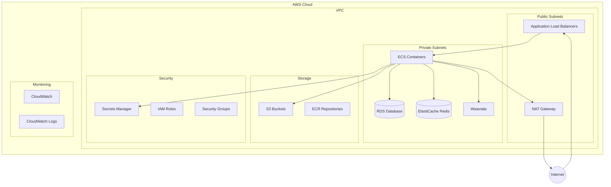

```mermaid
graph TD
    subgraph "AWS Cloud"
        subgraph "VPC"
            subgraph "Public Subnets"
                ALB[Application Load Balancers]
                NAT[NAT Gateway]
            end
            
            subgraph "Private Subnets"
                ECS[ECS Containers]
                RDS[(RDS Database)]
                REDIS[(ElastiCache Redis)]
                WEAVIATE[Weaviate]
            end
            
            subgraph "Storage"
                S3[S3 Buckets]
                ECR[ECR Repositories]
            end
            
            subgraph "Security"
                SECRETS[Secrets Manager]
                IAM[IAM Roles]
                SG[Security Groups]
            end
        end
        
        subgraph "Monitoring"
            CW[CloudWatch]
            LOGS[CloudWatch Logs]
        end
    end
    
    INTERNET((Internet)) --> ALB
    ALB --> ECS
    ECS --> RDS
    ECS --> REDIS
    ECS --> WEAVIATE
    ECS --> S3
    NAT --> INTERNET
    ECS --> NAT
    ECS --> SECRETS
```
